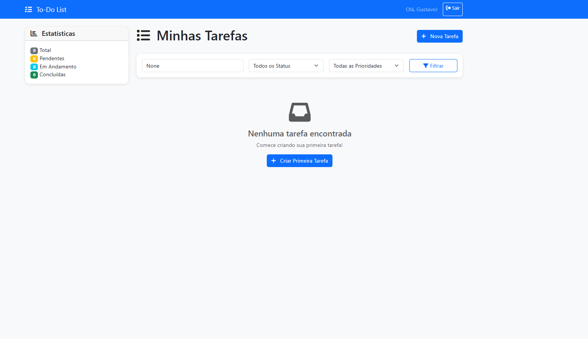

# 📝 Django To-Do List Portfolio

[](https://www.python.org/)
[](https://www.djangoproject.com/)
[](https://getbootstrap.com/)
[](LICENSE)

> **A clean and functional task management web app built with Django, showcasing my fullstack development skills and attention to detail.**

---

## 🚀 Technologies Used
- 🐍 **Python 3.11**
- 🌐 **Django 5.0**
- 🎨 **HTML5 + CSS3**
- ⚡ **Bootstrap 5**
- 🗄️ **SQLite3** (default Django database)
- 🧰 **Git & GitHub** (version control)

---

## 🎯 Features
- **User Authentication**: each user has a personal account and private task list.
- **Full CRUD Operations**: create, edit, complete, and delete tasks.
- **Responsive Design**: optimized for desktop and mobile devices.
- **Clean UI**: simple and easy to use.

---

## 📷 Screenshots
> *(Add your screenshots in the `screenshots` folder and link them here)*  
Example:



---

## 📂 Project Structure
- `todo/` → main Django app with views, models, and URLs.
- `templates/` → HTML templates using Django template inheritance.
- `static/` → static files (CSS, images, etc.).
- `db.sqlite3` → local development database.

---

## 📦 How to Run Locally
1. **Clone this repository**
   ```bash
   git clone https://github.com/GugaValenca/django-todo-portfolio.git
   cd django-todo-portfolio
